# CompAREdesign Package Testing Repository

This repository contains the validation tests for the [**CompAREdesign**](https://CRAN.R-project.org/package=CompAREdesign) R package, specifically for evaluating the functionality and accuracy of the **time-to-event** functions.

## Repository Contents

This repository includes the following folders:

- **`data`**: The output of the validation tests in Rdata format
- **`figures`**: The figures resulting for the validation tests.
- **`scripts`**: A directory containing the R scripts used to perform the validation tests.
- **`table`**: A table summarizing the test results in a structured format (CSV file).

## Testing Overview

The validation tests cover **72,576 different scenarios**, systematically evaluating the accuracy of the **time-to-event** functions implemented in the package. The tests focus on:

- Functionality verification across different parameter settings.
- Identification of numerical instability issues.
- Execution time assessment.

## Key Findings

- Minor precision corrections were required to address numerical errors caused by values **close to zero** in certain denominators.
- The functions proved **robust**, with only **0.06%** of cases yielding unstable results.
- The total execution time for all scenarios was **50.26 hours**.

Next, we will provide the graphical outputs of the test. The complete results are in `table/validation_results.csv`

## ARE results

Asymptotic Relative Efficiency (ARE) according to probabilities of observing the event.

- As $p0_e1$ increases the ARE decreases. This is logical because the more prevalent the first endpoint is, the less is the need of the second component.
- The ARE takes greater values when the value of the $p0_e2$ is high.

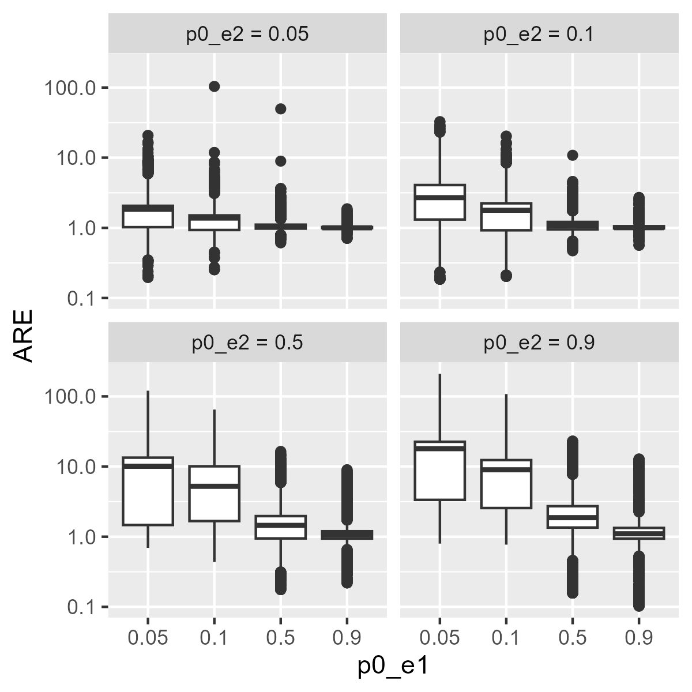

ARE according to the cause-specific HRs of the components.

- ARE is almost always greater than 1 when $HR_e2<HR_e1$
- ARE is usually greater than 1 when $HR_e2=HR_e1$

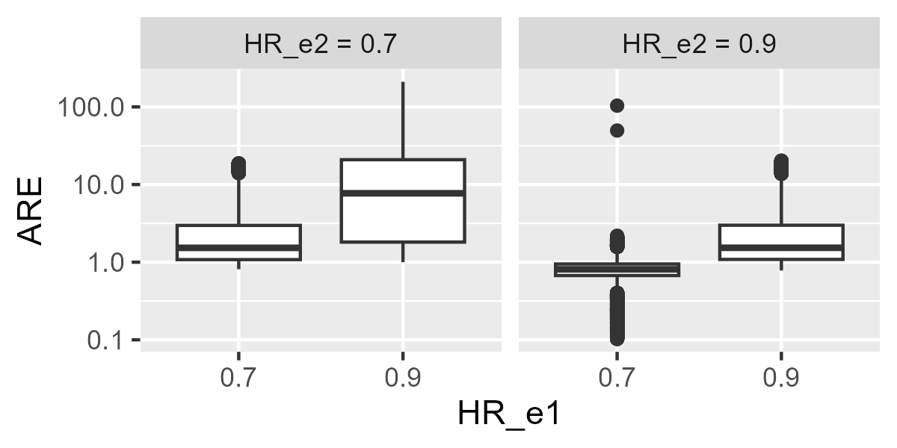

ARE according to shape parameters of the Weibull distributions for the time to event of the components.

- Shape parameters of the weibull distribution for the time to event for the components have less impact than other input parameters in the ARE.

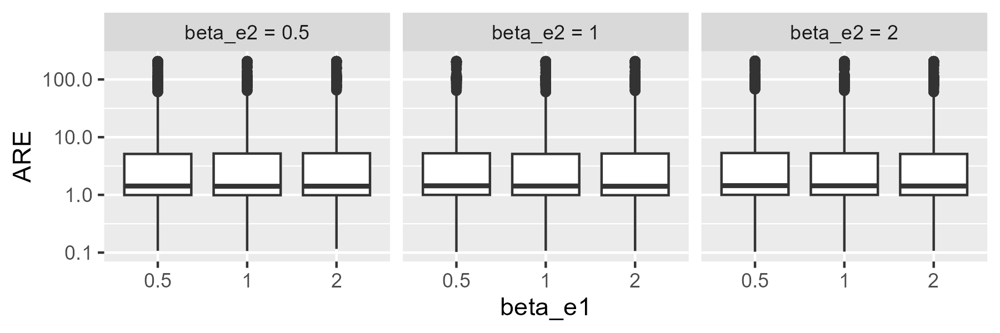

ARE according to the degree/type/measure of association between components.

- Association structures have less impact than other input parameters in the ARE.

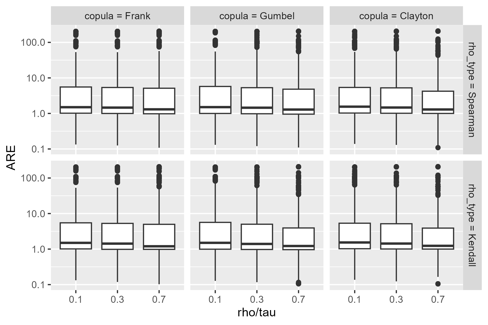

## Sample size results

Sample size of the composite endpoint (SS_CE) according to probabilities of observing the event.

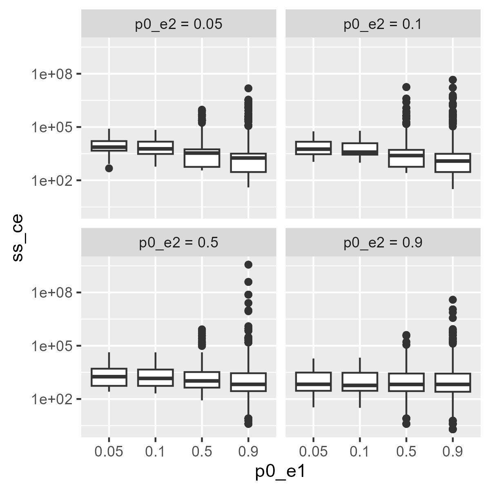

SS_CE according to the cause-specific HRs of the components.

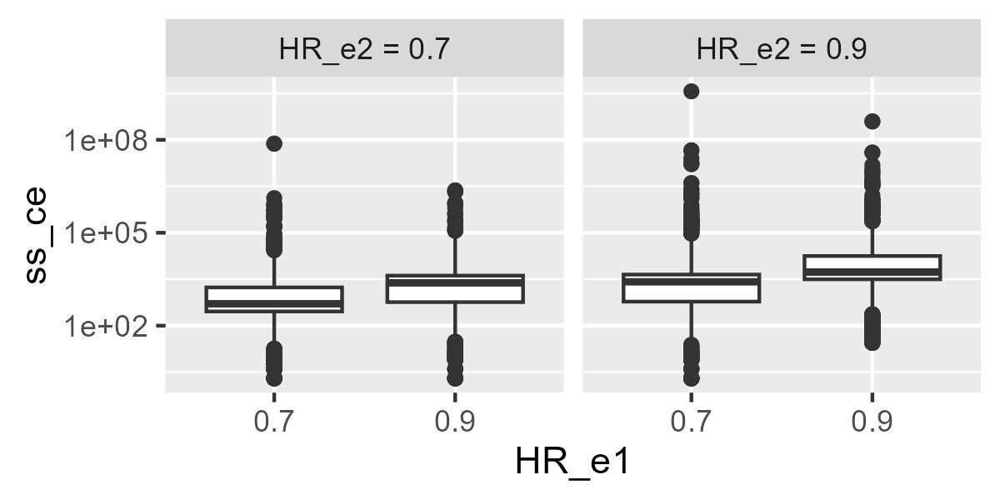

SS_CE according to shape parameters of the Weibull distributions for the time to event of the components.

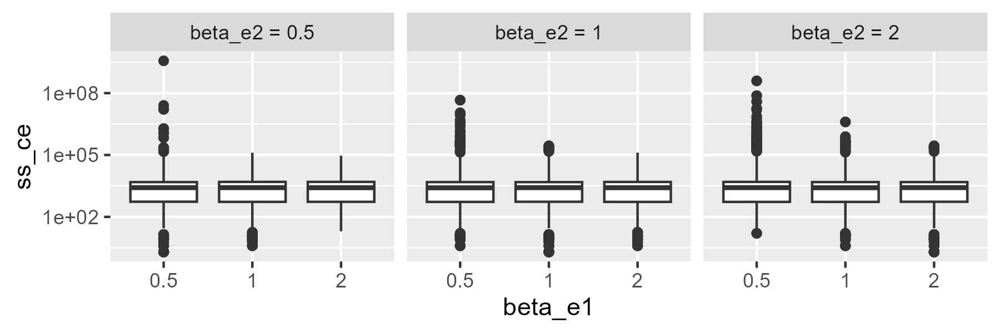

SS_CE according to the degree/type/measure of association between components.

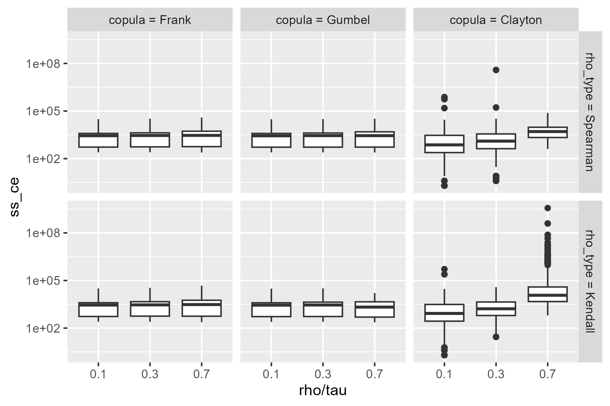

## Effect size results

Geometric Average Hazard Ratio (gAHR) according to probabilities of observing the event.

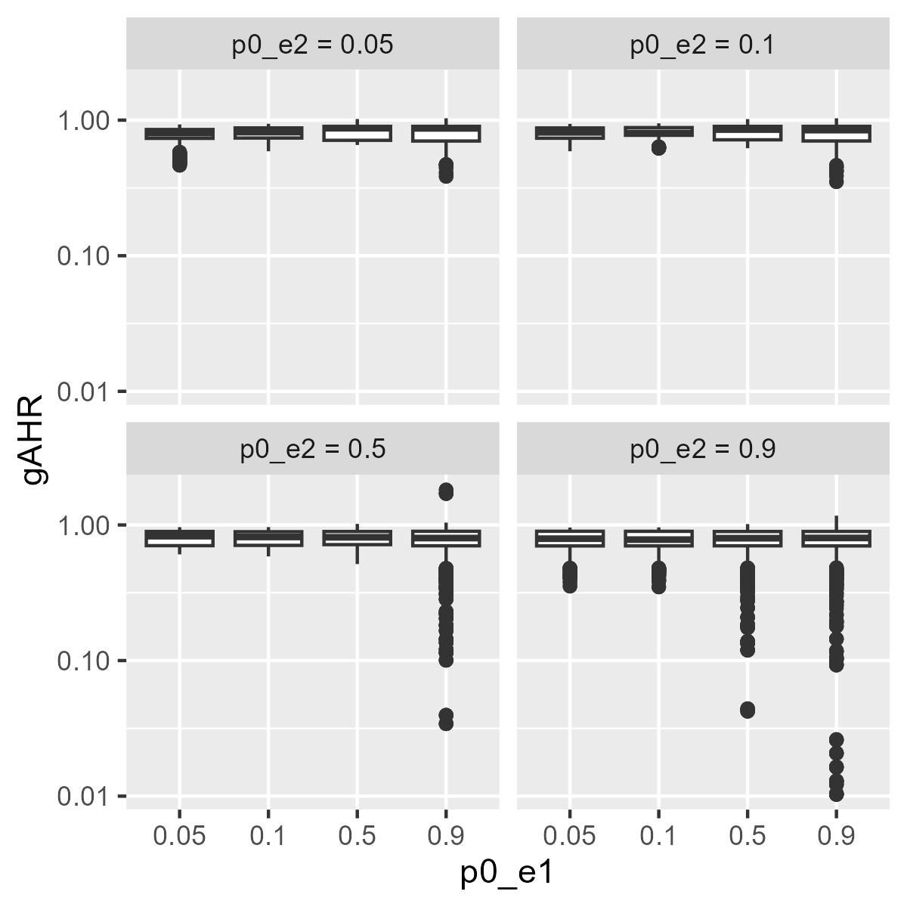

gAHR according to the cause-specific HRs of the components.

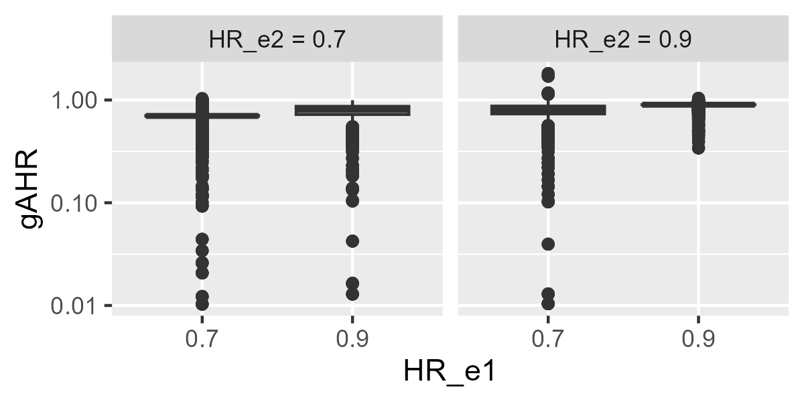

gAHR according to shape parameters of the Weibull distributions for the time to event of the components.

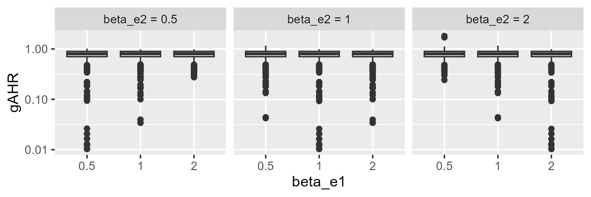

gAHR according to the degree/type/measure of association between components.

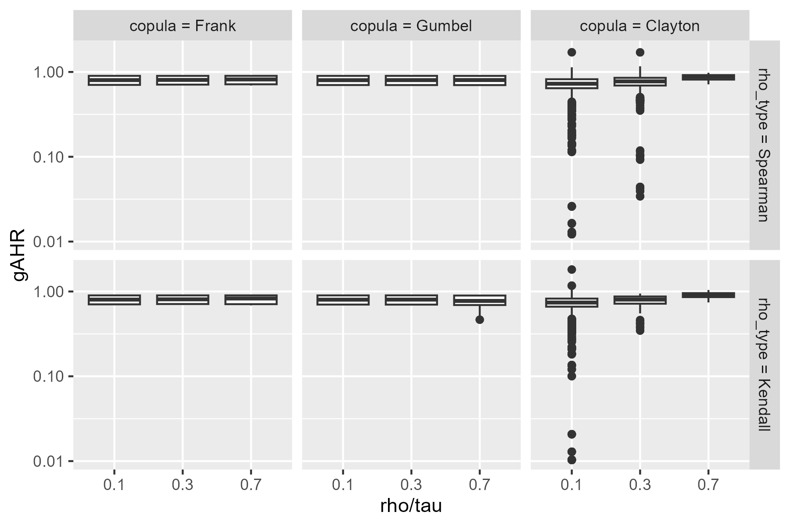

## Usage Instructions

To reproduce the tests, clone this repository and run the scripts in the `scripts/` directory. 

