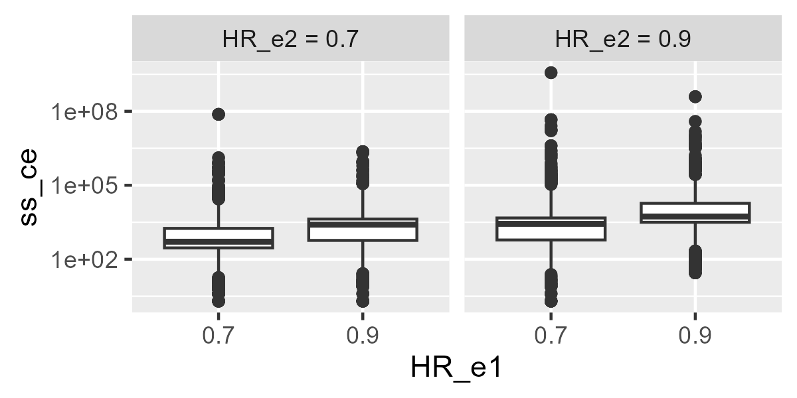

# CompAREdesign Package Testing Repository

**⚠️ This repository is under construction. Updates will be made regularly. ⚠️**

This repository contains the validation tests for the **CompAREdesign** R package, specifically for evaluating the functionality and accuracy of the **time-to-event** functions.

## Repository Contents

This repository includes the following folders:

- **`data`**: The output of the validation tests in Rdata format
- **`figures`**: The figures resulting for the validation tests.
- **`scripts`**: A directory containing the R scripts used to perform the validation tests.
- **`table`**: A table summarizing the test results in a structured format (CSV file).

## Testing Overview

The validation tests cover **72,576 different scenarios**, systematically evaluating the accuracy of the **time-to-event** functions implemented in the package. The tests focus on:

- Functionality verification across different parameter settings.
- Identification of numerical instability issues.
- Execution time assessment.

## Key Findings

- Minor precision corrections were required to address numerical errors caused by values **close to zero** in certain denominators.
- The functions proved **robust**, with only **0.06%** of cases yielding unstable results.
- The total execution time for all scenarios was **47.26 hours**.

Next, we will provide the graphical outputs of the test. You have the complete results in `table/validation_results.csv`

## ARE results

## Sample size results

## Effect size results

## Usage Instructions

To reproduce the tests, clone this repository and run the scripts in the `scripts/` directory. 

